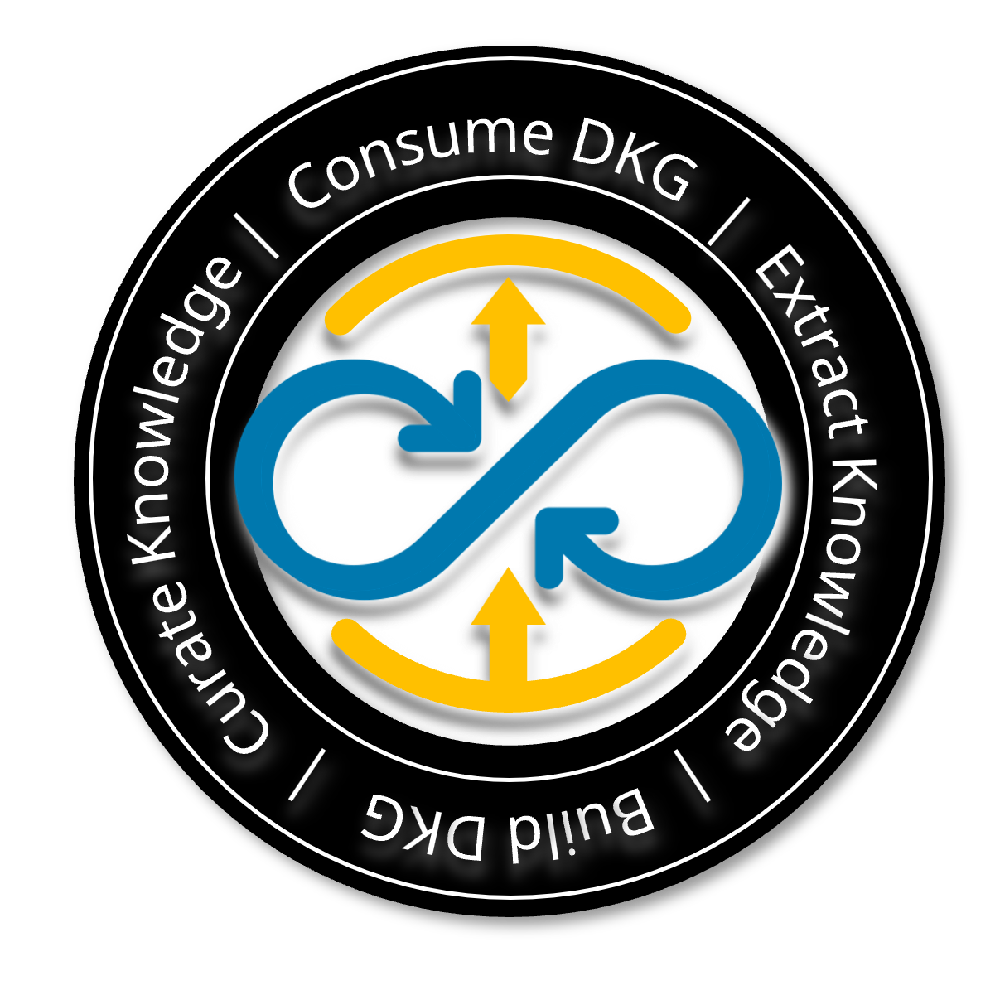

# Enterprise Data Knowledge Graph (DKG)
## What is DKG?
DKG is **explicit, formal, and shareable** knowledge about **data**, stored in a graph database. It is used to unify, store, and query data knowledge from diverse knowledge domains, enabling seamless integration and retrieval of data-related insights. Additionally, DKG can serve as the external knowledge base in a graph RAG approach, allowing LLMs to generate answers grounded in the company’s specific context.

In the DKG logo, the vertical axis "Build DKG - Consume DKG" symbolizes the unification of knowledge domains from different sources and the supply of linked data to be consumed by various applications. Meanwhile, the horizontal axis "Curate Knowledge - Extract Knowledge" represents the value provision and the continuous cycle of knowledge evolution and management by the sources, ensuring its relevance over time.

One way to extract knowledge from DKG is using [Neo4j Drivers](https://neo4j.com/docs/bolt/current/neo4j-drivers/). 

## How to build DKG?
A company typically has a business glossary, data modeling tool, data catalog, system catalog, etc., referred to as metadata sources where different subject matter experts document their knowledge. If not, starting from there is a good idea. Such capabilities take time to mature, especially to establish governance and processes. Following the [5-star deployment scheme](https://github.com/sbacso/enterprise_data_knowledge_graph/blob/main/design.md#metadata-sources) is a recommended approach. 

From these metadata sources, we have collected some typical concepts, referred to as **Asset Types**. They are stored in [onto starter kit](onto_starter_kit) and used to construct the Ontology DB. Now we have started [ontology development](https://github.com/sbacso/enterprise_data_knowledge_graph/blob/main/design.md#ontology-development-process), taking for granted that our scope is the knowledge about **data**.

### 1. Develop DKG Ontology
---
#### What is DKG Ontology?
DKG Ontology drives the development of design, governance, and engineering of DKG. DKG Ontology is stored in a separate graph database. It types the assets and standardizes the schemas before instantiating DKG, using a dataset called "Type Library":
- Types of asset, attribute and asset area
- Relationship types between metadata asset types
- Lists of metadata sources and asset areas
- Standardized schemas of the nodes and relationships

For design details, refer to [design.md](design.md).

---

#### Continue with ontology development:
Begin by creating a comprehensive list, which serves as the foundation for DKG governance.
- What are the definitions of the Asset Types? Are they clear and agreed upon across the company?
- What are the relationships between the Asset Types?
- What are the attributes of these Asset Types? 

In practice, sometimes we see "Software System" having an attribute called "owned_by_organization_unit". However, "Organization Unit" is an entity existing on its own. The better way is to model it as an asset-to-asset relationship - "Software System" is owned by "Organization Unit".

Once the list is done, we can use [this notebook](onto_starter_kit/onto_starter_kit.jpynb) to prepare data and load it into DKG Ontology graph.

### 2. Use Type Library to standardize
We can query ontology data and create views through GUIs.

But the most valuable use of DKG Ontology is the Type Library. It standardizes the schema and structure for assets, attributes and relationships. [This notebook](notebooks/output_type_library.ipynb) shows how to extract type library data from DKG Ontology. We can then output it to a preferred format and location for easy use in the script you create. 

Use the [functions](functions) (transformation logics) in the script.

### 3. Load the prepared data to DKG 
Include [this function](functions/to_dkg.py) in the script to lead the prepared data to DKG.

---

## Add New Knowledge Domains
Many more knowledge domains will be added to DKG, so each serves as a contributor. We start with analyzing the new knowledge domain's data model. Repeat step 1 and connect the new knowledge domain to the existing DKG Ontology. Then, repeat step 2 and 3.
