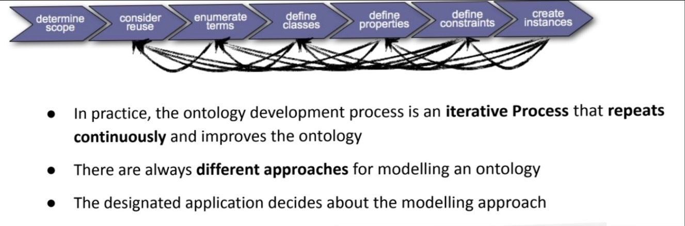
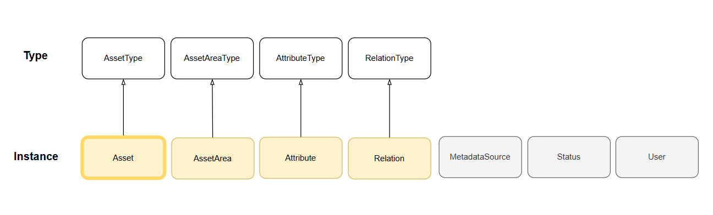
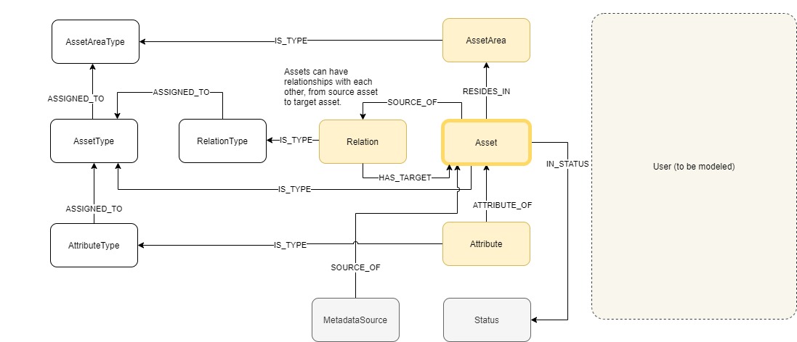
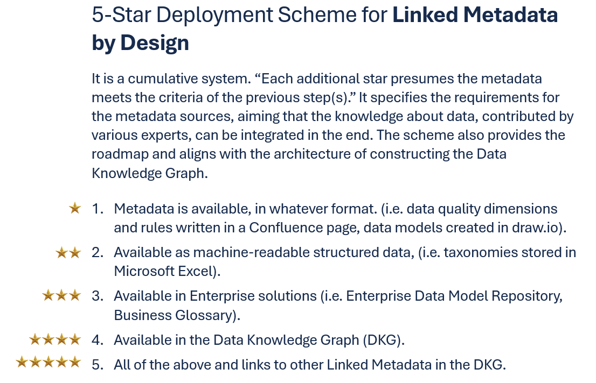
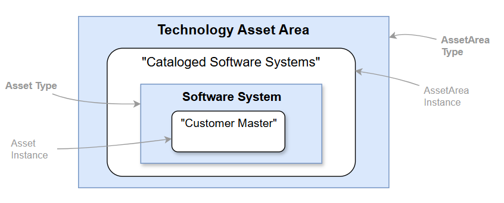
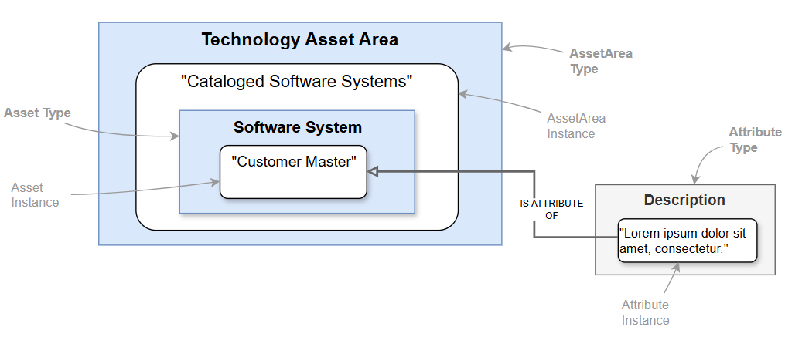
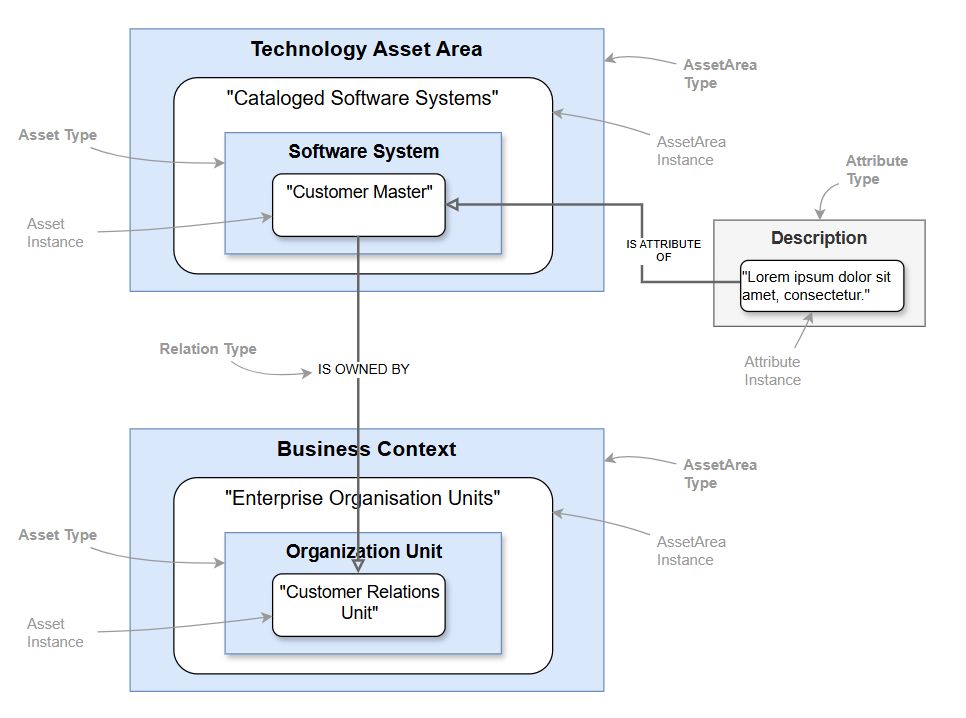
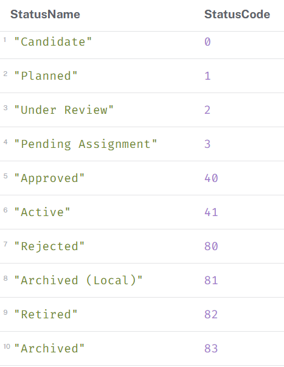

# Ontology Design


## Ontology Development Process


The ontology design follows **Ontology Development Process** to define concepts, classes, subsumptions, and relationships between the concepts. The primary goal is to construct **explicit, formal and shareable** knowledge and provide answers to data-related queries regardless of use cases or interfaces.

:exclamation: Since this is an iterative process that repeats continuously and improves the ontology, what is described hereafter is subject to change as knowledge grows and evolves.

## Knowledge Domains of Data


In the course of developping an application, Team B consumed Team A's Data Product 0, combined with their own data and created new Data Product 1. In the meantime, Data Product 1 also contains data from their own domain, which could be standalone Data Product 2.

## Key Concepts and Relationships


*Key Concepts* ``` ↑ ```




*Relationships* ``` ↑ ```


`Asset`, `AssetArea`, `Attribute`, `Relation` have types. Alongside `MetadataSource`, `Status`, `User`. Types are used to manage and govern metadata assets. uuids are assigned to all types and instances.


### Metadata Sources


*Linked Metadata Deployment Scheme* ``` ↑ ```


#### The three kinds of Metadata Sources

The first two refer to the **Enterprise solutions** in Linked Metadata Deployment Scheme, with different governance styles. The third one is temporary for experiment, and will change to the first or the second kind.

1. Centralized governance, *e.g. Software System Catalog*. Asset Areas are created and registered in DKG ontology, and loaded to DKG through the pipeline.

2. Federated governance, *e.g. Business Glossary*. Asset Areas are created in the source and loaded to DKG through the pipeline. They are registered in DKG Ontology as “*… created at the metadata source.” (starts with * ).

3. Incubation source, *e.g. “…_Confluence page”*. Asset Areas are created and registered in DKG ontology, and loaded to DKG through the pipeline.


### Assets, Asset Areas and Their Types


**Asset Area Types** collectively capture the broader knowledge about data. How the company is organized influences how the Asset Area Types are determined.

The ontology governs Which Asset Area Type should an Asset Type resides in. For which specific Asset Area should a specific Asset reside in, refers to **Metadata Sources** section.

If an Asset is in the Relation Type `is_part_of` with another Asset, only one of them should have `RESIDES_IN` relationship to the Asset Area for reducing the amount of the edges.


### Attributes and Attribute Types


The ontology governs what Attribute Types should an Asset Type have. An Attribute Type with its uuid can belong to various Asset Types.


### Relations and Their Types


Relation Types are exclusively for between-the-Asset-Types relationships. 
1. Propagated: established in the metadata source and ingested into DKG. Labeled as `RELATION`.
2. Automated: inferred by algorithms. Labeled as `REL_ALGO`. Typically for a large amount of assets from different metadata sources.
3. Manual: created by a person in DKG. Labeled as `REL_CURATOR`. Typically for a manageable amount of assets from different metadata sources.
4. Derived: not initially given but deduced through logical steps. Labeled as `REL_DERIVED`. Typically used to derive new knowledge or bring clarity.


### Status


Status is exclusively for Assets. However, not all Assets have status. The ontology governs the Status based on how it is managed by the metadata source, as well as assigning numeric codes for DKG operation.
